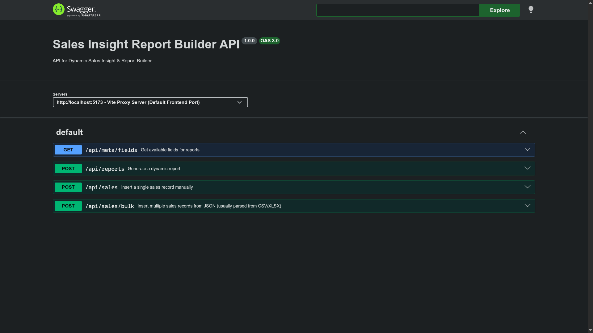

# API Documentation

Base URL:

- Lokal: `http://localhost:3000/api`
- Produksi (Vercel, same-origin): `/api`

Semua request dan response menggunakan `application/json`, kecuali endpoint export CSV. Semua rute berada di bawah prefix `/api`. Error dikembalikan dalam bentuk:

```json
{ "error": "Pesan kesalahan" }
```

Kode status: `400` validasi, `404` tidak ditemukan, `500` kesalahan server.

---

## Interactive API Docs (Swagger)

Aplikasi ini menyediakan Swagger UI untuk mempermudah eksplorasi dan pengujian API secara interaktif.

### Cara Mengakses Swagger
1. Pastikan server backend sedang berjalan (jalankan `npm run dev:backend` di terminal).
2. Buka browser dan kunjungi: **`http://localhost:3000/api/docs`** (local) atau **`https://sales-report-backend-eight.vercel.app/api/docs`**
3. Anda dapat melihat seluruh endpoint yang tersedia beserta format request/response-nya, dan mengujinya langsung menggunakan tombol **"Try it out"**.



---

## Kontrak Konfigurasi Laporan

Endpoint `/api/reports` dan `/api/reports/export` menerima satu objek konfigurasi:

| Field | Tipe | Aturan |
|---|---|---|
| `rows` | `string[]` | Dimensi pengelompokan. Wajib 1–3. Boleh: `sales_name`, `city`, `product`. |
| `columns` | `string[]` | Dimensi horizontal. Opsional, maksimal 1. |
| `values` | `object[]` | Wajib 1–3. Setiap item `{ field, aggregation }`. |
| `filters` | `object[]` | Opsional, jumlah bebas. Setiap item `{ field, operator, value }`. |

`values[].field` (measure): `amount` (Penjualan).

`values[].aggregation`:

| Key | Label |
|---|---|
| `sum` | Total |
| `avg` | Rata-rata |
| `count` | Jumlah Transaksi |

`filters[].operator` dan kompatibilitas tipe field:

| Operator | Label | Dimensi (teks) | Measure (angka) |
|---|---|---|---|
| `=` | Sama dengan | ✔ | ✔ |
| `!=` | Tidak sama dengan | ✔ | ✔ |
| `>` | Lebih dari | — | ✔ |
| `<` | Kurang dari | — | ✔ |
| `>=` | Lebih dari atau sama dengan | — | ✔ |
| `<=` | Kurang dari atau sama dengan | — | ✔ |
| `contains` | Mengandung (case-insensitive) | ✔ | — |
| `between` | Di antara (inclusive) | — | ✔ |

`between` menggunakan `value` berupa array dua angka, contoh: `"value": [50000000, 100000000]`.

Field yang sama tidak boleh dipakai di `rows` dan `columns` sekaligus.

---

## Endpoint

### GET `/api/health`

Status kesehatan API.

**Response `200`:**

```json
{ "status": "ok" }
```

---

### GET `/api/meta/fields`

Metadata untuk membangun kontrol UI: daftar dimensi (beserta nilainya), measure, perhitungan, dan operator.

**Response `200` (dipotong):**

```json
{
  "dimensions": [
    { "key": "sales_name", "label": "Nama Sales", "type": "text", "values": ["Andi", "Budi", "Citra"] },
    { "key": "city", "label": "Kota", "type": "text", "values": ["Bandung", "Jakarta", "Surabaya"] },
    { "key": "product", "label": "Produk", "type": "text", "values": ["Honda", "Suzuki", "Yamaha"] }
  ],
  "measures": [
    { "key": "amount", "label": "Penjualan", "type": "number" }
  ],
  "aggregations": [
    { "key": "sum", "label": "Total" },
    { "key": "avg", "label": "Rata-rata" },
    { "key": "count", "label": "Jumlah Transaksi" }
  ],
  "operators": [
    { "key": "=", "label": "Sama dengan", "argCount": 1, "textOnly": false, "numberOnly": false },
    { "key": "between", "label": "Di antara", "argCount": 2, "textOnly": false, "numberOnly": true }
  ]
}
```

---

### POST `/api/reports`

Membangun laporan berdasarkan konfigurasi dan mengembalikan hasil dalam format siap-render (pivot).

**Request:**

```json
{
  "rows": ["sales_name"],
  "columns": ["city"],
  "values": [
    { "field": "amount", "aggregation": "sum" }
  ],
  "filters": []
}
```

**Response `200`:**

```json
{
  "meta": {
    "rows": ["sales_name"],
    "columns": ["city"],
    "values": [{ "field": "amount", "aggregation": "sum" }],
    "rowFields": [{ "key": "sales_name", "label": "Nama Sales" }],
    "columnField": { "key": "city", "label": "Kota" },
    "valueColumns": [{ "field": "amount", "aggregation": "sum", "label": "Total Penjualan" }]
  },
  "columnKeys": ["Bandung", "Jakarta", "Surabaya"],
  "rows": [
    {
      "key": { "sales_name": "Andi" },
      "cells": { "Bandung": [90000000], "Jakarta": [195000000], "Surabaya": [0] },
      "rowTotal": [285000000]
    },
    {
      "key": { "sales_name": "Budi" },
      "cells": { "Bandung": [0], "Jakarta": [80000000], "Surabaya": [95000000] },
      "rowTotal": [175000000]
    },
    {
      "key": { "sales_name": "Citra" },
      "cells": { "Bandung": [70000000], "Jakarta": [0], "Surabaya": [85000000] },
      "rowTotal": [155000000]
    }
  ],
  "columnTotals": {
    "Bandung": [160000000],
    "Jakarta": [275000000],
    "Surabaya": [180000000]
  },
  "grandTotal": [615000000]
}
```

Keterangan struktur response:

- `meta.rowFields` — label kolom baris.
- `meta.columnField` — `null` bila tidak ada kolom.
- `meta.valueColumns` — pasangan nilai + perhitungan; urutan ini menjadi indeks elemen dalam setiap array angka.
- `columnKeys` — nilai unik dimensi kolom, diurutkan naik. `[]` bila tidak ada kolom.
- `rows[].key` — nilai dimensi baris.
- `rows[].cells[colKey][i]` — nilai untuk kolom tersebut, elemen ke-`i` sesuai `valueColumns`. Kombinasi tanpa data bernilai `0`.
- `rows[].rowTotal` — total per baris (dihitung PostgreSQL, `avg` benar dari data mentah).
- `columnTotals` — total per kolom.
- `grandTotal` — total keseluruhan.

**Contoh lain — dua nilai per baris:**

```json
{
  "rows": ["product"],
  "columns": [],
  "values": [
    { "field": "amount", "aggregation": "sum" },
    { "field": "amount", "aggregation": "avg" }
  ]
}
```

**Response `200`:**

```json
{
  "meta": {
    "rows": ["product"],
    "columns": [],
    "rowFields": [{ "key": "product", "label": "Produk" }],
    "columnField": null,
    "valueColumns": [
      { "field": "amount", "aggregation": "sum", "label": "Total Penjualan" },
      { "field": "amount", "aggregation": "avg", "label": "Rata-rata Penjualan" }
    ]
  },
  "columnKeys": [],
  "rows": [
    { "key": { "product": "Honda" }, "cells": { "__all__": [215000000, 107500000] }, "rowTotal": [215000000, 107500000] },
    { "key": { "product": "Suzuki" }, "cells": { "__all__": [150000000, 75000000] }, "rowTotal": [150000000, 75000000] },
    { "key": { "product": "Yamaha" }, "cells": { "__all__": [250000000, 83333333.33] }, "rowTotal": [250000000, 83333333.33] }
  ],
  "columnTotals": {},
  "grandTotal": [615000000, 87857142.86]
}
```

> Saat `columns` kosong, sel disimpan pada kunci `"__all__"`. Nilai rata-rata dibulatkan ke dua angka desimal.

**Contoh dengan filter (kombinasi baru, tidak ada query khusus):**

```json
{
  "rows": ["product"],
  "columns": ["sales_name"],
  "values": [{ "field": "amount", "aggregation": "avg" }],
  "filters": [{ "field": "city", "operator": "=", "value": "Jakarta" }]
}
```

**Error validasi `400`:**

```json
{ "error": "Field baris tidak dikenal: kota_bogor" }
```

---

### POST `/api/reports/export`

Sama seperti `/api/reports`, tetapi mengembalikan file CSV sebagai attachment.

**Request:**

```json
{
  "rows": ["city"],
  "columns": [],
  "values": [{ "field": "amount", "aggregation": "sum" }]
}
```

**Response `200`** — `Content-Type: text/csv; charset=utf-8`, `Content-Disposition: attachment; filename="laporan-YYYY-MM-DD.csv"`:

```csv
Kota,Total Penjualan
Bandung,160000000
Jakarta,275000000
Surabaya,180000000
Total,615000000
```

Dengan kolom, header menjadi berlapis:

```csv
Nama Sales,Bandung · Total Penjualan,Jakarta · Total Penjualan,Surabaya · Total Penjualan,Total Penjualan · Total
Andi,90000000,195000000,0,285000000
Budi,0,80000000,95000000,175000000
Citra,70000000,0,85000000,155000000
Total,160000000,275000000,180000000,615000000
```

---

### Laporan Tersimpan

Konfigurasi laporan dapat disimpan, dimuat, diubah, dan dihapus.

**GET `/api/reports/saved`** — daftar semua laporan tersimpan (terbaru dulu).

```json
{
  "reports": [
    {
      "id": 1,
      "name": "Total per Kota",
      "config": { "rows": ["city"], "columns": [], "values": [{ "field": "amount", "aggregation": "sum" }], "filters": [] },
      "created_at": "2026-08-07T09:15:00.000Z"
    }
  ]
}
```

**POST `/api/reports/saved`** — simpan laporan.

```json
{ "name": "Total per Kota", "config": { "rows": ["city"], "columns": [], "values": [{ "field": "amount", "aggregation": "sum" }], "filters": [] } }
```

**Response `201`:** objek laporan seperti di atas. Konfigurasi divalidasi sama seperti endpoint report.

**GET `/api/reports/saved/:id`** — detail satu laporan. `404` bila tidak ada.

**PUT `/api/reports/saved/:id`** — ubah `name` dan/atau `config`. Body sama dengan POST. `404` bila tidak ada.

**DELETE `/api/reports/saved/:id`** — hapus. `204` bila berhasil, `404` bila tidak ada.

---

### POST `/api/sales`

Menambahkan satu record penjualan secara manual.

**Request:**

```json
{
  "salesperson_name": "Andi",
  "city_name": "Jakarta",
  "product_name": "Honda",
  "amount": 120000000
}
```

**Response `201`:**

Data successfully saved.

**Error validasi `400`:**

Validation error.

---

### POST `/api/sales/bulk`

Menambahkan banyak record penjualan sekaligus dari JSON (biasanya dari hasil parse CSV/XLSX).

**Request:**

```json
[
  {
    "salesperson_name": "Andi",
    "city_name": "Jakarta",
    "product_name": "Honda",
    "amount": 120000000
  },
  {
    "salesperson_name": "Andi",
    "city_name": "Bandung",
    "product_name": "Yamaha",
    "amount": 90000000
  },
  {
    "salesperson_name": "Budi",
    "city_name": "Jakarta",
    "product_name": "Suzuki",
    "amount": 80000000
  }
]
```

**Response `201`:**

Rows successfully saved.

**Error validasi `400`:**

Validation error.

---

## Contoh Cepat

| Laporan (assignment) | Request body |
|---|---|
| Contoh 1 — Total per Kota | `{"rows":["city"],"columns":[],"values":[{"field":"amount","aggregation":"sum"}],"filters":[]}` |
| Contoh 4 — Total per Sales dan Kota | `{"rows":["sales_name"],"columns":["city"],"values":[{"field":"amount","aggregation":"sum"}],"filters":[]}` |
| Contoh 8 — Rata-rata per Sales | `{"rows":["sales_name"],"columns":[],"values":[{"field":"amount","aggregation":"avg"}],"filters":[]}` |
| Contoh 10 — Total dan Rata-rata per Produk | `{"rows":["product"],"columns":[],"values":[{"field":"amount","aggregation":"sum"},{"field":"amount","aggregation":"avg"}],"filters":[]}` |
| Filter harga > Rp80.000.000 | `{"rows":["city"],"columns":[],"values":[{"field":"amount","aggregation":"sum"}],"filters":[{"field":"amount","operator":">","value":80000000}]}` |
| Kombinasi dinamis baru | `{"rows":["product"],"columns":["sales_name"],"values":[{"field":"amount","aggregation":"avg"}],"filters":[{"field":"city","operator":"=","value":"Jakarta"}]}` |
